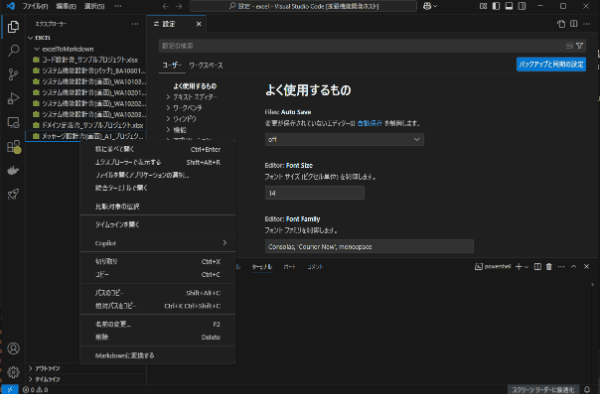
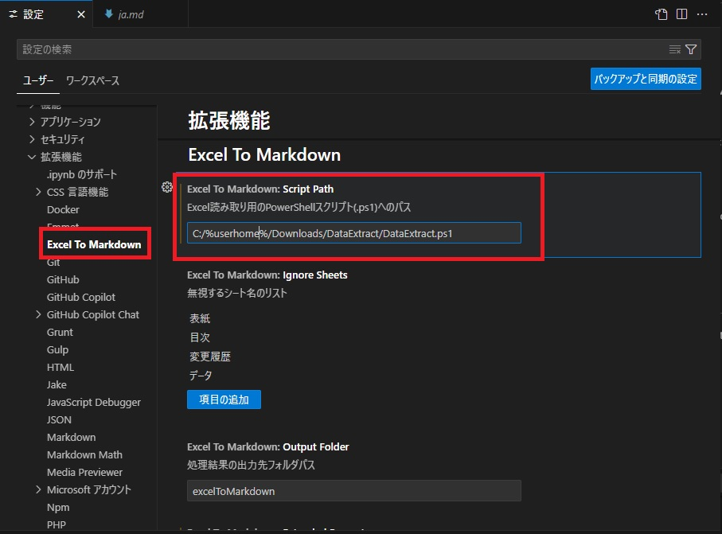

# excel-reader README

システム設計書が記載されているExcelをMarkdownに変換するVSCodeの拡張機能です。

以下のような方向けに作成しました

* Doclingをインストールするのすらめんどくさい
* VSCode上で全てを完結したい
* 社内のネットワーク制限などによりGithub Copilotしか使用できない

## Features

VSCode上に配置したシステム設計書が記載されているExcelファイルをPowerShellスクリプトとGithub Copilotを併用してMarkdownファイルに変換する拡張機能です。  
対象のExcelファイルを右クリック ＞ Markdownに変換 で変換することができます。

## Requirements

拡張機能を使用するには以下の準備が必要です。

1. Github Copilotのインストール  
   VSCodeの「拡張機能」タブから[https://marketplace.visualstudio.com/items?itemName=GitHub.copilot](https://marketplace.visualstudio.com/items?itemName=GitHub.copilot)をインストールしてください。
2. 拡張機能のインストール  
   [Releases](https://github.com/nagaoka-aya/excel-reader/releases)からvsixファイルをダウンロードしてください。  
   VSCode の「拡張機能」タブから右上のアイコンをクリックし、「VSIXからのインストール...」をクリックして、ダウンロードしたvsixファイルを選択します。
3. Scriptファイルの配置  
   [ExcelDataExtract.ps1](./scripts/ExcelDataExtract.ps1)を任意のフォルダにダウンロードしてください。
   Excel To Markdownの設定画面を開きscriptPathにps1ファイルへの絶対パスを設定してください。  
   
4. VSCodeのデフォルトのターミナルをPowerShellに変更  
   [VSCodeのデフォルトターミナルを変更する方法](https://zenn.dev/unsoluble_sugar/articles/362a17a7f57020) を参考にVSCodeのデフォルトのターミナルをPowerShellに変更してください。

以上で準備は完了です！

## Extension Settings

* `excelToMarkdown.scriptPath`: Excel読み取り用のPowerShellスクリプト(.ps1)へのパス
* `excelToMarkdown.ignoreSheets`: Excelシートのうち、Markdownへの変換をおこわ内シートの名前。デフォルト値は`["表紙","目次","変更履歴","データ"]`
* `excelToMarkdown.outputFolder`: 変換したMarkdownファイルの保存先です。デフォルト値は`excelToMarkdown`
* `excelToMarkdown.extendedPrompt`: Markdown変換時の拡張プロンプトです。例えばヘッダーを含むExcelを変換する場合に"ページの先頭3行目まではヘッダー情報なので、4行目以降を出力してください。"などと、変換に対して追加の要望を記載することができます。

## Known Issues

* 長大なExcelファイルには対応していません。Terminalの出力制限またはGithub Copilotの入力コンテキスト長を超える長さのテキストは変換できません。
* 数式には対応していません。

## Release Notes

### 0.0.1

Initial release
